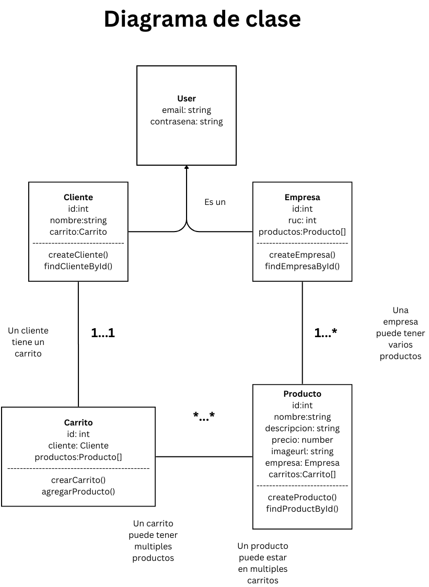
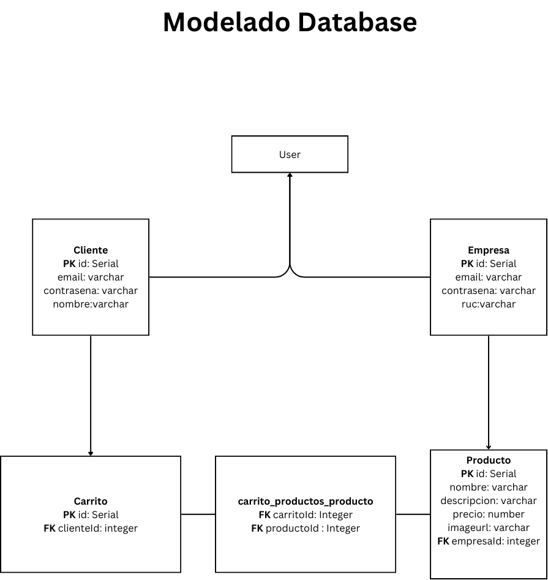

<p align="center">
  <a href="http://nestjs.com/" target="blank"></a>
</p>


## Installation

```bash
$ npm install
```

## Running the app

```bash
# development
$ npm run start

# watch mode
$ npm run start:dev

# production mode
$ npm run start:prod
```

## Migrations

Este proyecto permite la generacion de tablas automaticas en PostgreSQL a traves del feature migrations de Nest Js

1. Migrations lee todas las entidades del proyecto "Entity.ts"
2. Correr el comando npm run migration:generate db/migrations/"commit" : genera secuencias SQL 
3. Correr el comando npm run migration:run : corre las secuencias SQL generadas


## Diagrama de clase


## Modelado Base de Datos


## Test

```bash
# unit tests
$ npm run test

# e2e tests
$ npm run test:e2e

# test coverage
$ npm run test:cov
```